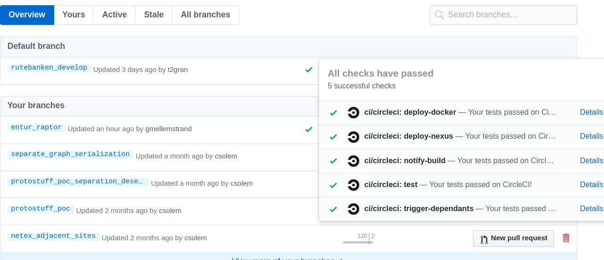
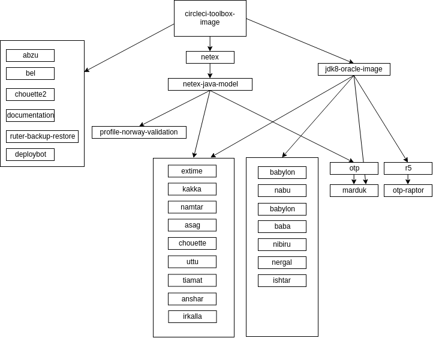

## CircleCI

---

## Hva?

SaaS - løsning for automatisk bygging og deploy (CI/CD)

---

## Hvordan?
* hvert repo har en `.circleci` mappe med en `config.yml`
* CircleCI bygger på github/bitbucket hooks
* "Byggene" kjøres i docker-containere

---

## Eksempel på config
```
version: 2
jobs:
  build:
    docker:
      - image: circleci/openjdk:8-jdk
    working_directory: ~/repo
    environment:
      JVM_OPTS: -Xmx3200m
      TERM: dumb
    steps:
      - checkout
      - restore_cache:
          keys:
          - v1-dependencies-{{ checksum "build.gradle" }}
          - v1-dependencies-
      - run: gradle dependencies
      - save_cache:
          paths:
            - ~/.gradle
          key: v1-dependencies-{{ checksum "build.gradle" }}
      - run: gradle test
```

---

## CircleCI status badge
Eks: https://github.com/entur/anshar

Kopieres fra settings
Eks:
```
[](https://circleci.com/gh/entur/tiamat/tree/master)
```

---

## Github Checks


---

## Slack-integrasjon

Må legges til per repository. Kopier URL fra et annet oppsett.

---

## Kjøre flere containere

Man kan kjøre flere containere dersom man mot formodning skulle trenge en database for test
```
jobs:
  build:
    docker:
      - image: eu.gcr.io/carbon-1287/circleci-toolbox-image
      - image: mdillon/postgis:9.6
        environment:
          POSTGRES_DB: chouette_test
          POSTGRES_USER: chouette
          POSTGRES_PASSWORD: chouette

```


---

## Rettigheter

Styres av Bitbucket, Github osv.
For å styre spesifikke ting som `Project settings` må du være admin eller project owner.

---

## Context

Felles parametere legges i en context.
F.eks nexus/jfrog-innlogging.

---
## CircleCI CLI

* Validere config lokalt
* Kjøre jobber lokalt. (workflows og cache ikke støttet)

---

## Rerun with SSH

Logg inn i container som kjører jobben.
Supert for feilsøking.
Klipp og lim inn ssh-kommando i egen terminal.

---

## Sikkerheten?

Ikke gjør
```
echo ${GCLOUD_SERVICE_KEY}
```
Bygglogg er åpne default når repo er åpent.

---

## Pull Requester

Man kan ikke bygge (kjøre tester) pull requester så lenge vi trenger secrets for å kjøre testene.
Ikke bra for samarbeid med andre parter.
Løsninger på dette?

---

## CircleCi toolbox image

* https://github.com/entur/circleci-toolbox-image
* Et docker-image laget for vårt team å forenkle vår CircleCI-config og unngå duplisering.
* Inneholder blant mer: gjenbrukbare script, docker client, gcloud, xml-pakker, libpng-dev, build-essential og ruby.
* Det kjøres shell-check på script (får ikke dette med kommandoer i circleci-config)
* Toolbox-imaget blir bygget med..... CircleCI

---

## Benytte seg av CircleCi toolbox image
```
jobs:
  build:
    docker:
      - image: eu.gcr.io/carbon-1287/circleci-toolbox-image
        auth:
          username: _json_key
          password: $GCLOUD_SERVICE_KEY
```
Imaget kunne egentlig vårt åpent i gcr for å unngå autentisering

---

## Varsling til Babylon

CircleCI sender tilsvarende JSON-format ved ferdig bygg som Jenkins.
Scriptet ligger i https://circleci.com/gh/entur/circleci-toolbox-image/

```
echo "{\"name\": \"${CIRCLE_PROJECT_REPONAME}\", \"build\": {\"status\": \"SUCCESS\", \"phase\": \"FINALIZED\", \"scm\": {\"commit\": \"${CIRCLE_SHA1}\"}}}" > message.json &&
echo "sending: $(cat message.json) to ${BUILD_STATUS_URL}" &&
curl --fail -X POST --data @message.json -H "apiKey: ${BUILD_STATUS_API_KEY}" -H "Content-Type: application/json" -H "ET-Client-Name: CircleCI" -H "ET-Client-ID: CircleCI-${CIRCLE_PROJECT_REPONAME}"  "${BUILD_STATUS_URL}";
```

---

## Starte andre workflows?

Ingen god støtte av CircleCI. Bruk script som ligger i vårt `circle-toolbox-image`:
```
/tools/downstream_single_trigger.sh "github/entur/chouette" "rutebanken_develop"
```
Se cci-config i https://github.com/entur/netex-java-model/blob/master/.circleci/config.yml for inspirasjon.

---

## Byggavhengigheter


draw.io xml-fil for denne tegningen ligger her:


---

## Personlige API-token

Personlig API-token for å trigge workflows med Curl.
Har ikke funnet en bedre løsning.

---

## Ulemper med CircleCi 1

Dokumentasjonen er forvirrende. Man skal ikke bruke 1.1-apiet og det oppfordres migrering 2.0.
Men det linkes fortsatt til 1.1 flere steder.

---

## Ulemper med CircleCi 2

Dårlig støtte for cross-repo-workflows?
Workflows som går på tvers av mange repositories fungerer ved å curle.
Men dette blir ikke visualisert.
Finnes ikke dette på 2.0?

---

## Ulemper med CircleCi 3

MÅ bruke personlig API token for å kalle workflows. Får ikke til med prosjekt-API-nøkkel.

---
## Ulemper med CircleCi 4

Av og til, når andre brukere har gjort endringer, må man gjøre hard refresh for å se endringer?

---
## Ulemper med CircleCi 5

Det er mye ventetid for triviell funksjonalitet å komme på plass:
https://discuss.circleci.com/t/triggering-workflows-by-api/22673


---
## Ulemper med CircleCi 6
Problemer med å passe environment variabler ned til script. Dette går ikke an:
```
      - run:
          name: Docker login
          command: tools/docker_login.sh
          environment:
            GCLOUD_SERVICE_KEY: $GCLOUD_SERVICE_KEY
```

```
        - run:
            name: Setup Environment Variables
            command: |
              echo 'export PATH="$GOPATH/bin:$PATH"' >> $BASH_ENV
              echo 'export GIT_SHA1="$CIRCLE_SHA1"' >> $BASH_ENV
```
Men det fungerer ikke med /bin/sh. Da må man bruke /bin/bash :thumbsup:

---

## Ulemper med CircleCi 7
CircleCI CLI fungerer ikke med workflows


## Ulemper med CircleCi 8
Det finnes ikke noe circleci-image med docker, bash og det vanlige. Så man må velge ruby, java osv.
Se: https://circleci.com/docs/2.0/circleci-images/

Diskutert her: https://discuss.circleci.com/t/circleci-images-for-2-0/12070

---

## TODO
* Flytte alle manuelle jobber som vi fortsatt trenger fra Devsetup/Vagrant til separate repoer med CircleCI-bygging.
* Bygge Pull Requester fra forks
* Bytte ut Nexus med JFrog (se settings-fil i `circleci-toolbox-image/tools/m2/settings.xml`)

---

### Links
Presentasjonens URL:
https://gitpitch.com/csolem/gitpitch-entur-circleci

Presentasjonen på github
https://github.com/csolem/gitpitch-entur-circleci
